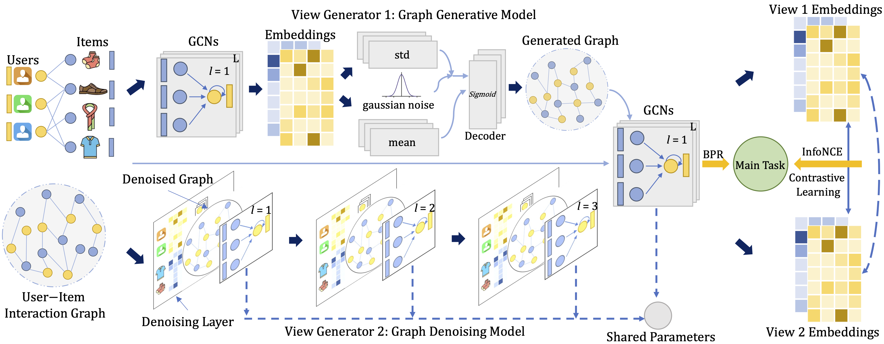

# Adaptive Graph Contrastive Learning for Recommendation

This is the PyTorch implementation for **AdaGCL** proposed in the paper **Adaptive Graph Contrastive Learning for Recommendation**, which is accepted by KDD 2023.

> Yangqin Jiang, Lianghao Xia, and Chao Huang. 2023. Adaptive Graph Contrastive Learning for Recommendation. In Proceedings of the 29th ACM SIGKDD Conference on Knowledge Discovery and Data Mining (KDD ’23), August 6–10, 2023, Long Beach, CA, USA. ACM, New York, NY, USA, 10 pages.

## 1. Introduction

Graph neural networks (GNNs) have recently emerged as an effective collaborative filtering (CF) approaches for recommender systems. The key idea of GNN-based recommender systems is to recursively perform message passing along user-item interaction edges to refine encoded embeddings, relying on sufficient and high-quality training data. However, user behavior data in practical recommendation scenarios is often noisy and exhibits skewed distribution. To address these issues, some recommendation approaches, such as SGL, leverage self-supervised learning to improve user representations. These approaches conduct self-supervised learning through creating contrastive views, but they depend on the tedious trial-and-error selection of augmentation methods. 

To fill the crucial gap, this work proposes a novel Adaptive Graph Contrastive Learning (AdaGCL) framework that conducts data augmentation with two adaptive contrastive view generators to better empower the CF paradigm. Specifically, it uses two trainable view generators - a graph generative model and a graph denoising model - to create adaptive contrastive views. With two adaptive contrastive views, AdaGCL introduces additional high-quality training signals into the CF paradigm, helping to alleviate data sparsity and noise issues. The overall framework of AdaGCL is given below.



## 2. Running environment

We develop our codes in the following environment:

- python==3.9.13
- numpy==1.23.1
- torch==1.11.0
- scipy==1.9.1
- torch-sparse==0.6.17

## 3. Datasets

| Dataset      | # User | # Item | # Interaction | Interaction Density |
| ------------ | ------ | ------ | ------------- | ------------------- |
| Last.FM      | 1,892  | 17,632 | 92,834        | 2.8 × $10^{-3}$     |
| Yelp         | 42,712 | 26,822 | 182,357       | 1.6 × $10^{-4}$     |
| BeerAdvocate | 10,456 | 13,845 | 1,381,094     | 9.5 × $10^{-3}$     |

## 4. How to run the codes

The command lines to train AdaGCL on the three datasets are as below. The un-specified hyperparameters in the commands are set as default.

- Last.FM

```python
python Main.py --data lastfm --gamma -0.95 --ib_reg 1e-2
```

- Yelp

```python
python Main.py --data yelp --ssl_reg 1 --ib_reg 1e-2 --epoch 100
```

- BeerAdvocate

```python
python Main.py --data beer --ib_reg 1e-2 --lambda0 1e-2 --ssl_reg 1
```

## 5. Citation

If you find this work helpful to your research, please kindly consider citing our paper.

```
@article{jiang2023adaptive,
  title={Adaptive Graph Contrastive Learning for Recommendation},
  author={Jiang, Yangqin and Huang, Chao and Xia, Lianghao},
  journal={arXiv preprint arXiv:2305.10837},
  year={2023}
}
```